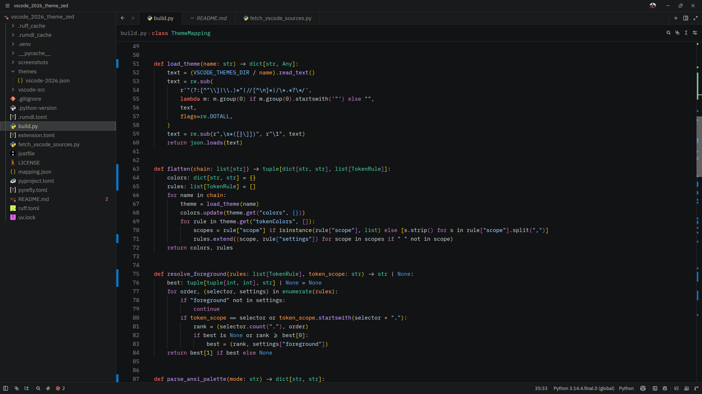
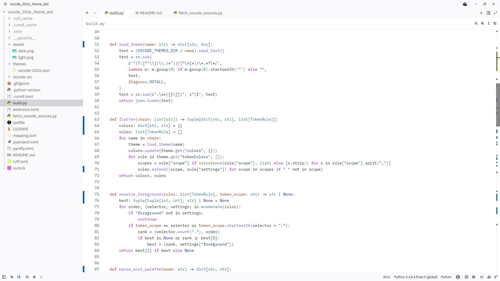

# VSCode 2026 Themes for Zed

> Port of the VS Code built-in **Dark 2026** and **Light 2026** themes with their full LSP semantic token supported.

## Dark



## Light



## Install

Zed → Extensions → search "VSCode 2026" → Install, then pick `VSCode 2026 Dark` or `VSCode 2026 Light` in the theme selector.

## Recommended settings

Parameter and readonly-const highlighting needs LSP semantic tokens; add to Zed `settings.json`:

```json
{
  "semantic_tokens": "combined",
  "global_lsp_settings": {
    "semantic_token_rules": [
      { "token_type": "variable", "token_modifiers": ["readonly"], "style": ["constant"] }
    ]
  }
}
```

## Dev

Zed → Extensions → Install Dev Extension → select this directory.

## Regenerate from VS Code

```sh
just generate [vscode-tag]
```
